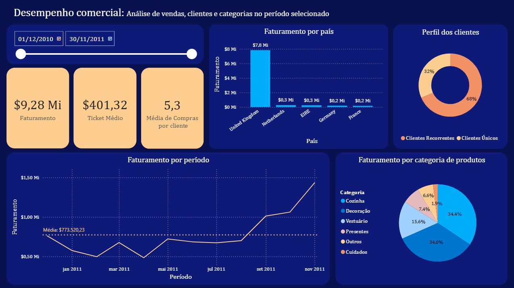

🇺🇸 English | 🇧🇷 [Versão em Português](README_pt-BR.md)

# Sales Data Analysis - Online Retail

This project aims to understand sales behavior in an e-commerce dataset, identifying consumption patterns, revenue concentration, and customer recurrence levels.

The analysis seeks to answer questions such as:
- Which factors have the greatest impact on revenue generation?
- Do customers show consistent repurchase behavior (indicating retention)?
- What actions can be suggested to increase revenue?

---

## Data Source

Public dataset available at:  
https://archive.ics.uci.edu/ml/machine-learning-databases/00352/Online%20Retail.xlsx

It contains transactional data such as: Orders (InvoiceNo); Products (Description, StockCode); Quantity and price; Purchase date; Customer (CustomerID); Country.

---

## Data Processing

Before the analysis, the following adjustments were made:

- Removal of irrelevant records (fees, shipping, commissions, etc.)
- Creation of the **Sales** variable  
- Product categorization based on keywords  
- Cleaning of inconsistencies and missing values  

---

## Analysis Performed

- Sales over time  
- Sales distribution by country  
- Revenue per customer  
- Top-selling products  
- Repurchase behavior  
- Revenue distribution (Pareto analysis)  
- Customer inactivity signals  

---

## Key Insights

- **High geographic concentration**: ~85% of revenue comes from the United Kingdom  
- **Uneven revenue distribution**: approximately 30% of customers account for 80% of total revenue  
- **Strong recurrence effect**: customers with multiple purchases generate a significant share of revenue  
- **Low dependence on specific products**: sales are well distributed across products  
- **Heterogeneous repurchase behavior**: no single pattern for time between purchases  

---

## Analysis Limitations

- The time between purchases shows high variability, making simple metrics such as averages unreliable  
- Identifying inactivity requires customer segmentation, which was not applied at this stage due to limited historical data  

---

## Dashboard

A dashboard was developed to visualize key metrics and patterns identified in the analysis.

---

## Conclusion

- Revenue is strongly driven by recurring customers and concentrated in a specific country  
- There is a good level of recurrence: 65% of customers purchased more than once, and 20% made more than 5 purchases  
- One-time buyers represent only ~6% of revenue, reinforcing the importance of customer retention  

---

## Next Steps

- Customer segmentation based on purchase behavior  
- Churn/inactivity modeling  
- Expansion of temporal analysis  

---

## Files

- Full Notebook (.ipynb): Contains the complete analysis, including data processing, visualizations, and insights  
- Dashboard (.pbix): Developed to present key indicators and identified patterns  

---

## Tools and Skills Applied

- **Python (pandas, matplotlib)**  
- **ETL (Extract, Transform, Load)**  
- **Power BI**  
- **Exploratory Data Analysis (EDA)** — pattern and behavior identification  
- **Business Analysis** — interpretation focused on revenue, recurrence, and concentration  
- **Data Storytelling** — communication of insights and analysis limitations  
